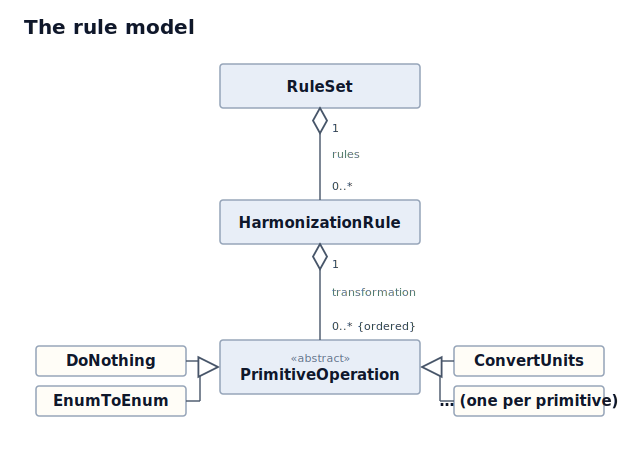

# Harmonization Examples

A layered set of chapters that introduce the
[harmonization framework](../../harmonization-framework) — its rule model, its
library of primitive operations, and its two interfaces (the Python API and the
CLI). They are built to be **read as documentation** and **run as self-checking
tests**.

The framework's job is *harmonization*: mapping varied source data onto a single
canonical schema with consistent column names and values. These chapters are a
tour of the tools it gives you for that — each one introduces a cluster of
primitives on a small, purpose-built dataset, and explains *why* each choice was
made, not just the mechanics. Start with chapter 01, which introduces the core
model; later chapters build on it.

## The rule model

A **RuleSet** is an ordered list of **rules**. Each rule maps one or more
**source** columns to a single **target** column by running the source value(s)
through a **transformation** — an ordered list of primitive **operations** (each
a named primitive plus its parameters). Rules carry **metadata** (e.g. the
rationale) alongside the mechanics. This is the whole model the chapters build on:



## How the chapters are structured

Every built chapter expresses **the same harmonization two ways**, so you can
enter from whichever interface you use and see that they agree:

| File | Interface | What it shows |
|------|-----------|---------------|
| `build_rules.py` | Python API | Constructs `HarmonizationRule`s **in code**, with the rationale in comments + rule `metadata`, then `RuleSet.save()`s the rules files. **The rules are defined here**; the other files are generated from it. |
| `rules.json` | — | Generated by `build_rules.py`. Consumed by the CLI. Commit it so the CLI works without running Python first. |
| `run_python.py` | Python API | Loads the rules, harmonizes via `harmonize_file`, and asserts the result matches `expected_output.csv`. |
| `run_cli.sh` | CLI | Runs the `harmonize` CLI against `rules.json` — no Python needed. |
| `input.csv` / `expected_output.csv` | — | Raw input and the pinned known-good output (the *golden master*: an approved reference output the run is checked against). |
| `README.md` | — | The harmonization story for that chapter. |

> **Note on interface parity.** The Python `harmonize_file` keeps *all* input
> columns plus the new target columns. The CLI emits *only* the target columns
> (plus `source dataset`/`original_id` when `--include-metadata` is passed).
> This is a real, intentional difference in the framework — each chapter's
> README calls out which golden master each interface reproduces.

## The catalog

| # | Chapter | Status | Primitives showcased |
|---|---------|--------|----------------------|
| 01 | [Hello Harmonization](01-hello-harmonization/) | ✅ built | `do_nothing`, `enum_to_enum` |
| 02 | [Units & Numbers](02-units-and-numbers/) | ✅ built | `convert_units`, `scale`, `round`, `threshold`, `bin`, `format_number` |
| 03 | [Text & Names](03-text-and-names/) | ✅ built | `substitute`, `normalize_text`, `truncate` |
| 04 | [Dates](04-dates/) | ✅ built | `convert_date` (incl. fail-fast) |
| 05 | [Enums & Lookups](05-enums-and-lookups/) | ✅ built | `enum_to_enum` (strict vs. default), `cast`, integer-keyed maps |
| 06 | [Multi-source Aggregation](06-multi-source-aggregation/) | ✅ built | `reduce` (sum/one-hot), `parse_array`, `cast` |
| 07 | [Nulls & Missing-Value Codes](07-nulls-and-missing-codes/) | ✅ built | null pass-through, missing-value-code handling, `--on-missing` |
| 08 | [Clinical Intake Showcase](08-clinical-intake-showcase/) | ✅ built | realistic blend of the above |

## Running the chapters

These chapters run against the framework installed in the sibling repo's
virtualenv. From this `examples/` directory:

```bash
# Python interface (also runs the golden-master assertion):
../../harmonization-framework/venv/bin/python 01-hello-harmonization/run_python.py

# CLI interface:
bash 01-hello-harmonization/run_cli.sh
```

Each `run_python.py` prints `OK: ...` when its output matches the golden master.
